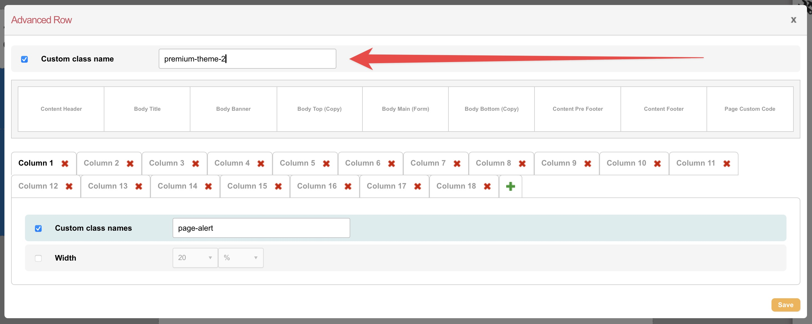
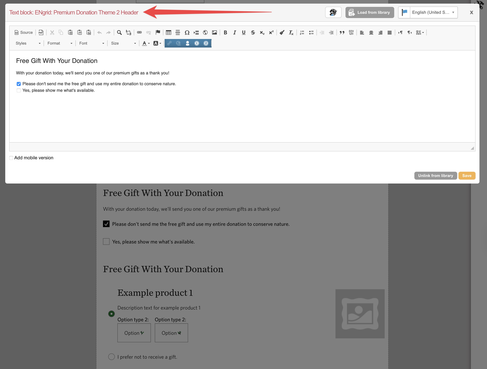
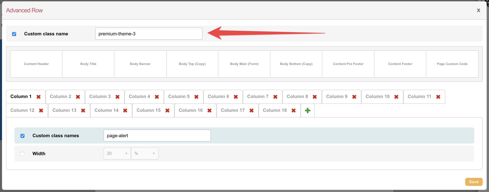
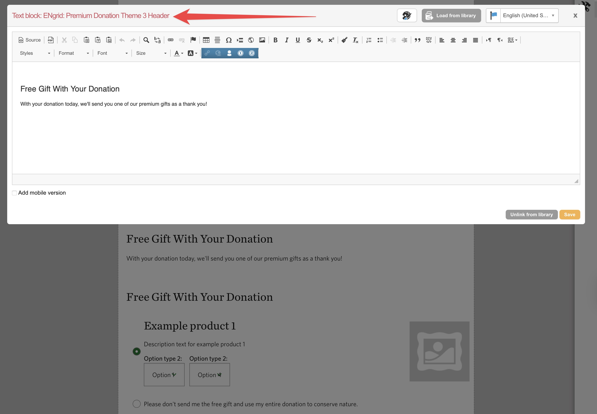

# Premium Donation Reference Pages

This document is a reference on how to create Premium Donation Pages on Engaging Networks using the 3 themes created by 4Site.

For a quick setup, you can clone the following pages, from the "Ω1. 4Site Live - Reference Pages for Duplication" folder:

- REFERENCE - ENgrid PREMIUM donation page Theme 1 (Test Gateway)
- REFERENCE - ENgrid PREMIUM donation page Theme 2 (Test Gateway)
- REFERENCE - ENgrid PREMIUM donation page Theme 3 (Test Gateway)

After creating your clone, make a test donation to ensure everything is working correctly. After that, change the Payment Gateway to the live one and make a real donation.

## How to create a Premium Donation Page from scratch:

1. **Create a new EN page**: Go to the "Pages" section in your Engaging Networks account and click on "Manage Pages". Then click on the "+ New Page" button.
2. **Select the page type**: Choose "Premium Donation" as the page type.
3. **Set Page Settings**: Fill in the required fields, including the Page Name, Public Title, Base URL, etc. As for the Template, select "4Site Page Template - Center Center 1 Column".
4. **Create the Page Grid**: In the Page Builder, create an Advanced Row with 18 columns [to setup the Grid](https://engrid.4sitestudios.com/docs/v2/developing-with-engrid#advanced-row) for the Page Content. Repeat that process on both Page 1 and Page 2.
5. **Setup the Content**: Add Text Blocks and Code Blocks to the Page Grid, following the design of any reference page.
6. **Setup the Premium Block**: Below the Form Block with Frequencies and Amounts, add a Premium Gift Block.
7. **Configure the Premium Block**: In the Premium Gift Block, select the products you want to offer, creating different ranges for Single and Recurring donations. Don't forget to set the Header Text and "No Gift" option label.
8. **Save and Test**: Save the page and make a test donation to ensure everything is working correctly. After that, change the Payment Gateway to the live one and make a real donation.

By following these steps, you will create a Premium Donation Page on Engaging Networks using the **default** theme (Theme 1).

## How to customize the Premium Donation Page to use Theme 2:

Assuming you have already created a Premium Donation Page using the default theme, follow these steps to customize it to use Theme 2:

1. **Add a CSS Class to the Advanced Row**: In the Page Builder, edit the Advanced Row you created for the Page Content and add the following CSS Class: `premium-theme-2`.

1. **Add the Theme 2 Header**: Above the Premium Gift Block, load the "ENgrid: Premium Donation Theme 2 Header" Text Block from the Library.

1. **Save and Test**: Save the page and make a test donation to ensure everything is working correctly. After that, change the Payment Gateway to the live one and make a real donation.

## How to customize the Premium Donation Page to use Theme 3:

Assuming you have already created a Premium Donation Page using the default theme, follow these steps to customize it to use Theme 3:

1. **Add a CSS Class to the Advanced Row**: In the Page Builder, edit the Advanced Row you created for the Page Content and add the following CSS Class: `premium-theme-3`.

2. **Add the Theme 3 Header**: Above the Premium Gift Block, load the "ENgrid: Premium Donation Theme 3 Header" Text Block from the Library.

3. **Save and Test**: Save the page and make a test donation to ensure everything is working correctly. After that, change the Payment Gateway to the live one and make a real donation.